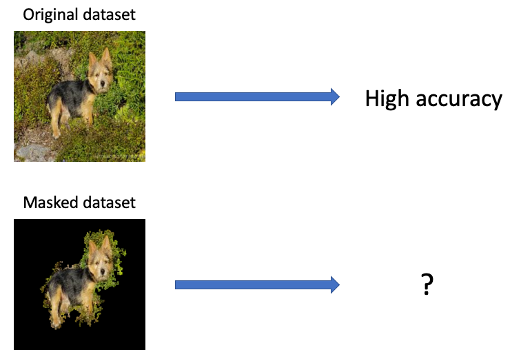
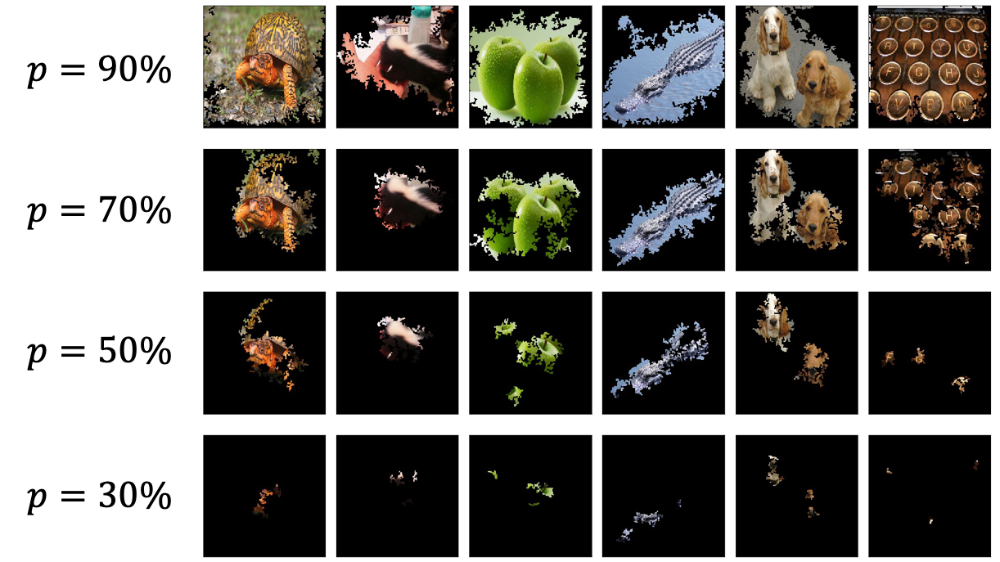
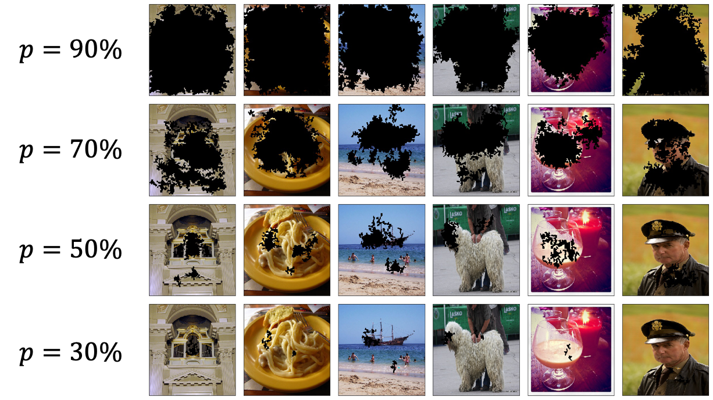

# Masking-Important-Pixels
Code for experiments from the blog post: "What happens when we mask out the "unimportant" 
parts of an image?" https://seansaito.github.io/2019/12/03/masked-accuracy/

## Gist

In the corresponding [blog post](https://seansaito.github.io/2019/12/03/masked-accuracy/), 
we experiment and observe how keeping the important regions of an image and masking 
the rest affects the accuracy of several state-of-the-art convolutional neural networks. We find 
important regions of an image via [Integrated Gradients](https://arxiv.org/abs/1703.01365), 
a state-of-the-art method for pixel-wise gradient attribution for neural networks. 
We rely on the implementation from 
[integrated-gradients-pytorch](https://github.com/TianhongDai/integrated-gradient-pytorch)
for our experiments.

## Example images

`p` refers to the pixels which gradient attributions account for the top `p`% of all gradient 
attributions. So when `p=90`, we keep/mask pixels which account for 90% of gradient attributions.

#### Keeping important pixels

#### Masking important pixels

